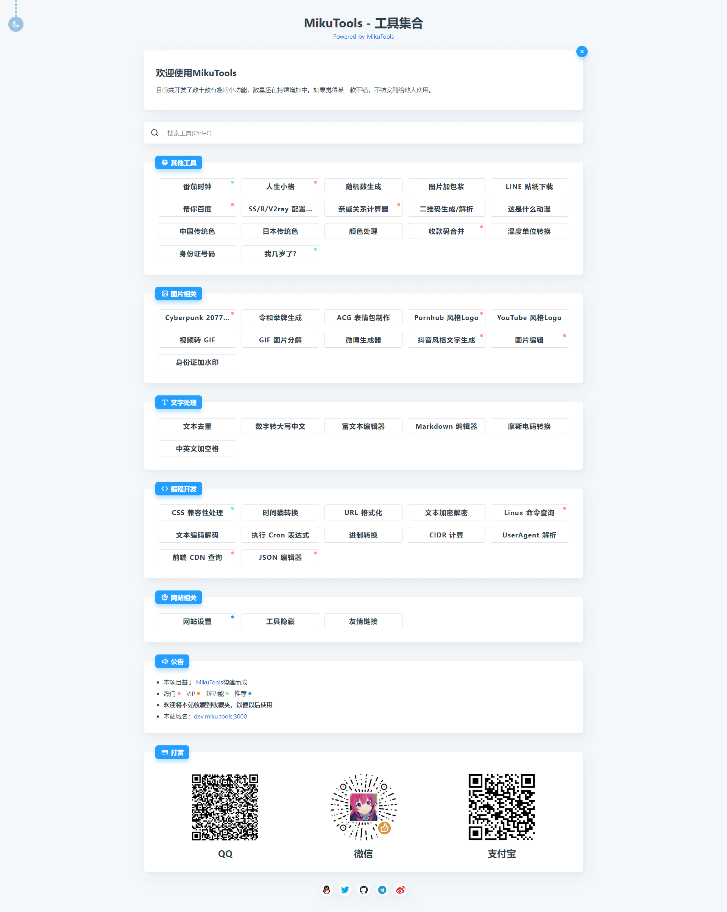

<p align="center"></p>
<h1 align="center">Miku Tools</h1>
<p align="center">一个轻量的工具集合</p>
<p align="center">
    <a href="https://github.com/Ice-Hazymoon/MikuTools/blob/master/LICENSE">
        
    </a>
    <a href="https://vuejs.org/">
        
    </a>
    <a href="http://imiku.me/">
        
    </a>
    <a href="https://miku.tools/">
        
    </a>
</p>

## 备用域名

如网站出现无法访问的情况，可尝试使用备用域名

> [http://tools.imiku.me](http://tools.imiku.me)

## 介绍

本项目是 [https://miku.tools](https://miku.tools) 的开源版本，保留了部分无需后端的功能。

> [https://miku.tools](https://miku.tools)

## 预览



## 开发

```bash
yarn install
yarn dev
```

## 构建

```bash
yarn install
yarn generate
```

## 不会前端开发或不想安装相关环境

> 对于不会打包程序的同学，准备好了一份打包好开箱即用的版本

下载 [dist.7z](https://raw.githubusercontent.com/Ice-Hazymoon/MikuTools/master/dist.7z)，直接上传解压至虚拟主机或网站根目录即可使用

## 其他

Q: 后端什么时候开源？  
A: 因为本职不是后端，所以代码写的太垃圾（虽然前端也没好到哪去），无论安全性还是性能方面都有所欠缺，所以暂时不会开源。

Q: 我应该如何添加新功能？  
A: 参考 `/pages/*.vue` 中的文件新建页面，善用 **CTRL+F** 进行相关模块的查找，然后在 `/tools/index.js` 里添加相关的工具信息。对前端新人不太友好

Q: 我可以参与开发 MikuTools 吗？  
A: 当然可以，随时欢迎提交 PR，会视情况添加到 [MikuTools](https://miku.tools) 主站

Q: 我能给 MikuTools 提新功能吗？  
A: issues 区随时欢迎你。

Q: MikuTools 的主要技术栈是什么？  
A: Vue 全家桶 + [Nuxt.js](https://zh.nuxtjs.org/)

## 更新

本仓库仅供一个开源版本的备份，并不用于纪录提交纪录等，当[主站](https://miku.tools)更新到一定程度上的稳定版本时，才会重新更新该仓库

## 贡献者

<!-- ALL-CONTRIBUTORS-LIST:START - Do not remove or modify this section -->
<!-- prettier-ignore-start -->
<!-- markdownlint-disable -->
<table>
  <tr>
    <td align="center"><a href="https://github.com/Git-So"><br /><sub><b>Git-So</b></sub></a><br /><a href="https://github.com/Ice-Hazymoon/MikuTools/commits?author=Git-So" title="Code">💻</a></td>
    <td align="center"><a href="https://github.com/KeJunMao"><br /><sub><b>KeJunMao</b></sub></a><br /><a href="https://github.com/Ice-Hazymoon/MikuTools/commits?author=KeJunMao" title="Code">💻</a> <a href="#question-KeJunMao" title="Answering Questions">💬</a></td>
    <td align="center"><a href="https://github.com/tamshen"><br /><sub><b>tamshen</b></sub></a><br /><a href="#design-tamshen" title="Design">🎨</a></td>
    <td align="center"><a href="https://github.com/houko"><br /><sub><b>houko</b></sub></a><br /><a href="#translation-houko" title="Translation">🌍</a></td>
    <td align="center"><a href="https://github.com/bougieL"><br /><sub><b>bougieL</b></sub></a><br /><a href="https://github.com/Ice-Hazymoon/MikuTools/commits?author=bougieL" title="Code">💻</a> <a href="#ideas-bougieL" title="Ideas, Planning, & Feedback">🤔</a></td>
  </tr>
</table>

<!-- markdownlint-enable -->
<!-- prettier-ignore-end -->
<!-- ALL-CONTRIBUTORS-LIST:END -->
